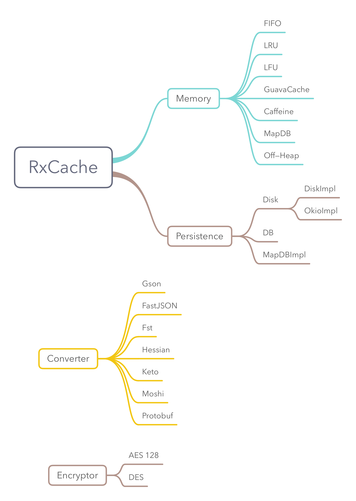

# RxCache

A local reactive cache for Java and Android. Now, it supports heap memory、off-heap memory and disk cache.

RxCache 是一款支持 Java 和 Android 的 Local Cache，目前支持内存、堆外内存、磁盘缓存。

[](http://www.weibo.com/fengzhizi715)
[](https://www.apache.org/licenses/LICENSE-2.0.html)
[](https://app.codacy.com/app/fengzhizi715/RxCache?utm_source=github.com&utm_medium=referral&utm_content=fengzhizi715/RxCache&utm_campaign=Badge_Grade_Dashboard)
[](https://jitpack.io/#fengzhizi715/RxCache)

# 功能特点：

* 支持二级缓存：Memory、Persistence
* 各个缓存可以拥有有效时间，超过时间缓存会过期
* Memory 默认支持 FIFO、LRU、LFU 算法的实现
* Memory 支持 Guava Cache、Caffeine、MapDB、OHC、Chronicle-Map 的实现
* Memory 支持堆外内存(off-heap)
* Persistence 默认使用 Gson 实现对象的序列化和反序列化
* Persistence 支持使用 FastJSON、Moshi、Kryo、Hessian、FST、Protobuf 实现对象的序列化和反序列化
* Persistence 的 AbstractConverter 拥有加密功能，默认使用 AES 128、DES 算法进行加密
* 支持显示缓存的信息，包括 Memory 缓存使用的统计数据，Persistence 使用的类型和 Converter 的类型
* 支持缓存 key 同步删除、异步删除的策略  
* 支持 Kotlin, 特别是使用 kotlin extension 模块，可以规避范型擦除
* 支持 Kotlin Coroutines
* 支持 [Result](https://github.com/fengzhizi715/Result)
* 使用 Builder 模式可以生成复杂对象的 Type
* 线程安全
* 支持 RxJava 3、RxJava 2
* 支持 Retrofit 风格使用缓存

## 更详细的功能请查看 [wiki](https://github.com/fengzhizi715/RxCache/wiki)

## Tips

> RxCache 1.5.1 以及之前的版本使用 RxJava 2.x，在 RxCache 1.6.0 到 RxCache 2.0 的版本使用 RxJava 3.x。
>
> RxCache 2.0 之后，既支持 RxJava 3.x 也支持 RxJava 2.x，整体设计更为合理。

# 最新版本

模块|最新版本
---|:-------------:
rxcache-core|[](https://jitpack.io/#fengzhizi715/RxCache)|
rxcache-rxjava3|[](https://jitpack.io/#fengzhizi715/RxCache)|
rxcache-rxjava2|[](https://jitpack.io/#fengzhizi715/RxCache)|
rxcache-extension|[](https://jitpack.io/#fengzhizi715/RxCache)|
rxcache-extension-coroutines|[](https://jitpack.io/#fengzhizi715/RxCache)|
rxcache-extension-result|[](https://jitpack.io/#fengzhizi715/RxCache)|
rxcache-memory-guava-cache|[](https://jitpack.io/#fengzhizi715/RxCache)|
rxcache-memory-caffeine|[](https://jitpack.io/#fengzhizi715/RxCache)|
rxcache-memory-off-heap|[](https://jitpack.io/#fengzhizi715/RxCache)|
rxcache-memory-mapdb|[](https://jitpack.io/#fengzhizi715/RxCache)|
rxcache-memory-ohc|[](https://jitpack.io/#fengzhizi715/RxCache)|
rxcache-memory-chronicle-map|[](https://jitpack.io/#fengzhizi715/RxCache)|
rxcache-converter-fastjson|[](https://jitpack.io/#fengzhizi715/RxCache)|
rxcache-converter-moshi|[](https://jitpack.io/#fengzhizi715/RxCache)|
rxcache-converter-kryo|[](https://jitpack.io/#fengzhizi715/RxCache)|
rxcache-converter-hessian|[](https://jitpack.io/#fengzhizi715/RxCache)|
rxcache-converter-fst|[](https://jitpack.io/#fengzhizi715/RxCache)|
rxcache-converter-protobuf|[](https://jitpack.io/#fengzhizi715/RxCache)|
rxcache-persistence-okio|[](https://jitpack.io/#fengzhizi715/RxCache)|
rxcache-persistence-mapdb|[](https://jitpack.io/#fengzhizi715/RxCache)|
rxcache-persistence-diskmap|[](https://jitpack.io/#fengzhizi715/RxCache)|

将它添加到项目的 root build.gradle 中：

```groovy
	allprojects {
		repositories {
			...
			maven { url 'https://jitpack.io' }
		}
	}
```

# [下载](https://github.com/fengzhizi715/RxCache/blob/master/Download.md)





# 感谢

* 参考了[RxCache](https://github.com/VictorAlbertos/RxCache)的实现
* 参考了[RxCache](https://github.com/z-chu/RxCache)的实现
* 参考了[TypeBuilder](https://github.com/ikidou/TypeBuilder)的实现


# Contributors：

* [snailflying](https://github.com/snailflying)

## TODO List:

* 支持 Java 11 以上
* 重构 diskmap (是否有必要呢？)


联系方式
===

Wechat：fengzhizi715


> Java与Android技术栈：每周更新推送原创技术文章，欢迎扫描下方的公众号二维码并关注，期待与您的共同成长和进步。


License
-------

    Copyright (C) 2018 - present, Tony Shen.

    Licensed under the Apache License, Version 2.0 (the "License");
    you may not use this file except in compliance with the License.
    You may obtain a copy of the License at

       http://www.apache.org/licenses/LICENSE-2.0

    Unless required by applicable law or agreed to in writing, software
    distributed under the License is distributed on an "AS IS" BASIS,
    WITHOUT WARRANTIES OR CONDITIONS OF ANY KIND, either express or implied.
    See the License for the specific language governing permissions and
    limitations under the License.
