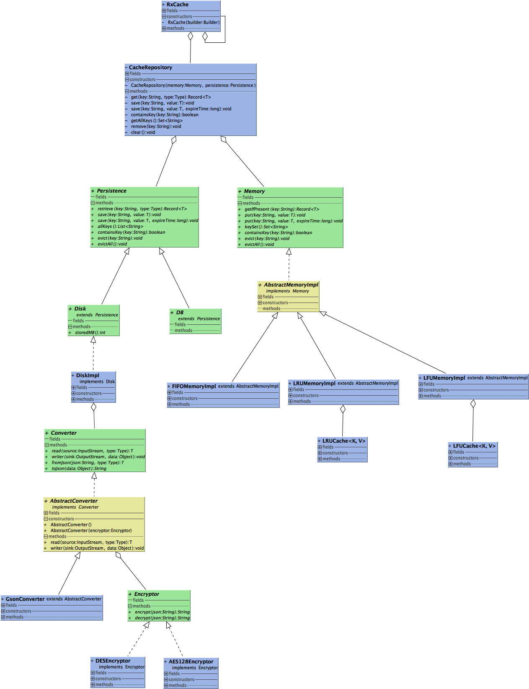

# RxCache

RxCache 是一款支持 Java 和 Android 的 Local Cache 。目前，支持堆内存、堆外内存、磁盘缓存。

[](http://www.weibo.com/fengzhizi715)
[](https://www.apache.org/licenses/LICENSE-2.0.html)


# 一. 功能特点：

* 拥有二级缓存：Memory、Persistence
* 各个缓存可以拥有有效时间，超过时间缓存会过期
* Memory 默认支持 FIFO、LRU、LFU 算法的实现
* Memory 额外支持 Guava Cache、Caffeine、MapDB 的实现
* Memory 支持堆外内存(off-heap)
* Persistence 默认使用 gson 实现对象的序列化和反序列化
* Persistence 额外支持使用 fastjson、moshi 实现对象的序列化和反序列化
* Persistence 的 DiskImpl 拥有加密功能，默认支持 AES 128、DES 加密
* 使用 Builder 模式生成 Type
* 线程安全
* 支持 Retrofit 风格使用缓存
* 支持 RxJava 2


## 支持的 Annotation：

注解名称|作用|备注
---|-------------|-------------
@CacheClass|设置缓存类，标注一个Class对象|参数注解
@CacheKey|设置缓存的key值|方法注解
@CacheLifecycle|设置缓存的过期时间，只在缓存保存时有效|方法注解
@CacheMethod|设置缓存的操作方法。以及返回的对象是 RxJava 的各种 Observable 类型，或者返回所存储的对象类型。|方法注解
@CacheValue|设置缓存的值|参数注解

# 二. 最新版本

模块|最新版本
---|:-------------:
rxcache-core|[  ](https://bintray.com/fengzhizi715/maven/rxcache-core/_latestVersion)|
rxcache-proxy|[  ](https://bintray.com/fengzhizi715/maven/rxcache-proxy/_latestVersion)|
rxcache-guava-cache|[  ](https://bintray.com/fengzhizi715/maven/rxcache-guava-cache/_latestVersion)|
rxcache-caffeine|[  ](https://bintray.com/fengzhizi715/maven/rxcache-caffeine/_latestVersion)|
rxcache-fastjson|[  ](https://bintray.com/fengzhizi715/maven/rxcache-fastjson/_latestVersion)|
rxcache-moshi|[  ](https://bintray.com/fengzhizi715/maven/rxcache-moshi/_latestVersion)|
rxcache-off-heap|[  ](https://bintray.com/fengzhizi715/maven/rxcache-off-heap/_latestVersion)|

对于 Java 工程，如果使用 gradle 构建，由于默认没有使用 jcenter()，需要在相应 module 的 build.gradle 中配置

```groovy
repositories {
    mavenCentral()
    jcenter()
}
```

## 下载：

rxcache-core

```groovy
implementation 'com.safframework.rxcache:rxcache-core:1.2.1'
```

rxcache-proxy

```groovy
implementation 'com.safframework.rxcache:rxcache-proxy:1.2.1'
```

rxcache-guava-cache

```groovy
implementation 'com.safframework.rxcache:rxcache-guava-cache:1.2.1'
```

rxcache-caffeine

```groovy
implementation 'com.safframework.rxcache:rxcache-caffeine:1.2.1'
```

rxcache-fastjson

```groovy
implementation 'com.safframework.rxcache:rxcache-fastjson:1.2.1'
```

rxcache-moshi

```groovy
implementation 'com.safframework.rxcache:rxcache-moshi:1.2.1'
```

rxcache-off-heap

```groovy
implementation 'com.safframework.rxcache:rxcache-off-heap:1.2.1'
```


# 三. RxCache 的设计：

下图是 rxcache-core 模块的 uml 类图



RxCache 包含了两级缓存： Memory 和 Persistence 。

Memory 的默认实现 FIFOMemoryImpl、LRUMemoryImpl、LFUMemoryImpl 分别使用 FIFO、LRU、LFU 算法来缓存数据。

在 extra 模块还有 Guava Cache、Caffeine 的实现。它们都是成熟的 Local Cache，如果不想使用默认的 MemoryImpl ，完全可以使用 extra 模块成熟的替代方案。


Persistence 的接口跟 Memory 很类似。

考虑到持久层包括 Disk、DB。于是分别单独抽象了 Disk、DB 接口继承 Persistence。

在 Disk 的实现类 DiskImpl 中，它的构造方法注入了 Converter 接口：

```java
public class DiskImpl implements Disk {

    private File cacheDirectory;
    private Converter converter;

    public DiskImpl(File cacheDirectory,Converter converter) {

        this.cacheDirectory = cacheDirectory;
        this.converter = converter;
    }

    ......
}
```

Converter 接口用于对象储存到文件的序列化和反序列化，目前默认支持 Gson，在 extra 模块还有 FastJSONConverter。

Converter 的抽象实现类 AbstractConverter 的构造方法注入了 Encryptor 接口：

```java
public abstract class AbstractConverter implements Converter {

    private Encryptor encryptor;

    public AbstractConverter() {
    }

    public AbstractConverter(Encryptor encryptor) {

        this.encryptor = encryptor;
    }

    ......
}
```

Encryptor 接口用于将存储到 Disk 上的数据进行加密和解密，目前 RxCache 支持 AES128 和 DES 两种加密方式。不使用 Encryptor 接口，则存储到 Disk 上的数据是明文，也就是一串json字符串。

## 3.1 支持 Java

在 example 模块下，包括了一些常见 Java 使用的例子。

例如，最简单的使用：

```java
import com.safframework.rxcache.RxCache;
import com.safframework.rxcache.domain.Record;
import domain.User;
import io.reactivex.Observable;
import io.reactivex.functions.Consumer;

/**
 * Created by tony on 2018/9/29.
 */
public class Test {

    public static void main(String[] args) {

        RxCache.config(new RxCache.Builder());

        RxCache rxCache = RxCache.getRxCache();

        User u = new User();
        u.name = "tony";
        u.password = "123456";
        rxCache.save("test",u);

        Observable<Record<User>> observable = rxCache.load2Observable("test", User.class);

        observable.subscribe(new Consumer<Record<User>>() {

            @Override
            public void accept(Record<User> record) throws Exception {

                User user = record.getData();
                System.out.println(user.name);
                System.out.println(user.password);
            }
        });
    }
}
```

带 ExpireTime 的缓存测试：

```java
import com.safframework.rxcache.RxCache;
import com.safframework.rxcache.domain.Record;
import domain.User;

/**
 * Created by tony on 2018/10/5.
 */
public class TestWithExpireTime {

    public static void main(String[] args) {

        RxCache.config(new RxCache.Builder());

        RxCache rxCache = RxCache.getRxCache();

        User u = new User();
        u.name = "tony";
        u.password = "123456";
        rxCache.save("test",u,2000);

        try {
            Thread.sleep(2500);
        } catch (InterruptedException e) {
            e.printStackTrace();
        }

        Record<User> record = rxCache.get("test", User.class);

        if (record==null) {
            System.out.println("record is null");
        }
    }
}
```

跟 Spring 整合并且 Memory 的实现使用 GuavaCacheImpl：

```java
import com.safframework.rxcache.RxCache;
import com.safframework.rxcache.extra.memory.GuavaCacheImpl;
import com.safframework.rxcache.memory.Memory;
import org.springframework.beans.factory.annotation.Configurable;
import org.springframework.context.annotation.Bean;

/**
 * Created by tony on 2018/10/5.
 */
@Configurable
public class ConfigWithGuava {

    @Bean
    public Memory guavaCache(){
        return new GuavaCacheImpl(100);
    }

    @Bean
    public RxCache.Builder rxCacheBuilder(){
        return new RxCache.Builder().memory(guavaCache());
    }

    @Bean
    public RxCache rxCache() {

        RxCache.config(rxCacheBuilder());

        return RxCache.getRxCache();
    }
}
```

测试一下刚才的整合：

```java
import com.safframework.rxcache.RxCache;
import com.safframework.rxcache.domain.Record;
import domain.User;
import io.reactivex.Observable;
import io.reactivex.functions.Consumer;
import org.springframework.context.ApplicationContext;
import org.springframework.context.annotation.AnnotationConfigApplicationContext;

/**
 * Created by tony on 2018/10/5.
 */
public class TestWithGuava {

    public static void main(String[] args) {

        ApplicationContext ctx = new AnnotationConfigApplicationContext(ConfigWithGuava.class);

        RxCache rxCache = ctx.getBean(RxCache.class);

        User u = new User();
        u.name = "tony";
        u.password = "123456";
        rxCache.save("test",u);

        Observable<Record<User>> observable = rxCache.load2Observable("test", User.class);

        observable.subscribe(new Consumer<Record<User>>() {
            @Override
            public void accept(Record<User> record) throws Exception {

                User user = record.getData();
                System.out.println(user.name);
                System.out.println(user.password);
            }
        });
    }
}
```


## 3.2 支持 Android

为了更好地支持 Android，我创建了 RxCache4a: https://github.com/fengzhizi715/RxCache4a


## 3.3 基于 Annotation 完成缓存操作

类似 Retrofit 风格的方式，支持通过标注 Annotation 来完成缓存的操作。

例如先定义一个接口，用于定义缓存的各种操作。

```java
public interface Provider {

    @CacheKey("user")
    @CacheMethod(methodType = MethodType.GET)
    <T> Record<T> getData(@CacheClass Class<T> clazz);


    @CacheKey("user")
    @CacheMethod(methodType = MethodType.SAVE)
    @CacheLifecycle(duration = 2000)
    void putData(@CacheValue User user);


    @CacheKey("user")
    @CacheMethod(methodType = MethodType.REMOVE)
    void removeUser();

    @CacheKey("test")
    @CacheMethod(methodType = MethodType.GET, observableType = ObservableType.MAYBE)
    <T> Maybe<Record<T>> getMaybe(@CacheClass Class<T> clazz);
}
```

通过 CacheProvider  创建该接口，然后可以完成各种缓存操作。

```java
public class TestCacheProvider {

    public static void main(String[] args) {


        RxCache.config(new RxCache.Builder());

        RxCache rxCache = RxCache.getRxCache();

        CacheProvider cacheProvider = new CacheProvider.Builder().rxCache(rxCache).build();

        Provider provider = cacheProvider.create(Provider.class);

        User u = new User();
        u.name = "tony";
        u.password = "123456";

        provider.putData(u); // 将u存入缓存中

        Record<User> record = provider.getData(User.class); // 从缓存中获取key="user"的数据

        if (record!=null) {

            System.out.println(record.getData().name);
        }

        provider.removeUser(); // 从缓存中删除key="user"的数据

        record = provider.getData(User.class);

        if (record==null) {

            System.out.println("record is null");
        }

        User u2 = new User();
        u2.name = "tony2";
        u2.password = "000000";
        rxCache.save("test",u2);

        Maybe<Record<User>> maybe = provider.getMaybe(User.class); // 从缓存中获取key="test"的数据，返回的类型为Maybe
        maybe.subscribe(new Consumer<Record<User>>() {
            @Override
            public void accept(Record<User> userRecord) throws Exception {

                User user = userRecord.getData();
                if (user!=null) {

                    System.out.println(user.name);
                    System.out.println(user.password);
                }
            }
        });
    }
}
```

## 3.4 支持堆外内存(off-heap)

DirectBufferMemoryImpl 支持堆外内存，并采用FIFO的方式。

```java
import com.safframework.rxcache.RxCache;
import com.safframework.rxcache.domain.Record;
import com.safframework.rxcache.offheap.DirectBufferMemoryImpl;
import domain.User;
import io.reactivex.Observable;
import io.reactivex.functions.Consumer;

/**
 * Created by tony on 2018-12-22.
 */
public class TestOffHeap {

    public static void main(String[] args) {

        RxCache.config(new RxCache.Builder().memory(new DirectBufferMemoryImpl(3)));

        RxCache rxCache = RxCache.getRxCache();

        User u1 = new User();
        u1.name = "tony1";
        u1.password = "123456";
        rxCache.save("test1",u1);

        User u2 = new User();
        u2.name = "tony2";
        u2.password = "123456";
        rxCache.save("test2",u2);

        User u3 = new User();
        u3.name = "tony3";
        u3.password = "123456";
        rxCache.save("test3",u3);

        User u4 = new User();
        u4.name = "tony4";
        u4.password = "123456";
        rxCache.save("test4",u4);

        Observable<Record<User>> observable = rxCache.load2Observable("test1", User.class);

        if (observable!=null) {

            observable.subscribe(new Consumer<Record<User>>() {
                @Override
                public void accept(Record<User> record) throws Exception {

                    User user = record.getData();
                    System.out.println(user.name);
                    System.out.println(user.password);
                }
            });
        }
    }
}
```

# 感谢

* 参考了[RxCache](https://github.com/VictorAlbertos/RxCache)的实现
* 参考了[RxCache](https://github.com/z-chu/RxCache)的实现
* 参考了[TypeBuilder](https://github.com/ikidou/TypeBuilder)的实现


联系方式
===

Wechat：fengzhizi715


> Java与Android技术栈：每周更新推送原创技术文章，欢迎扫描下方的公众号二维码并关注，期待与您的共同成长和进步。


License
-------

    Copyright (C) 2018 - present, Tony Shen.

    Licensed under the Apache License, Version 2.0 (the "License");
    you may not use this file except in compliance with the License.
    You may obtain a copy of the License at

       http://www.apache.org/licenses/LICENSE-2.0

    Unless required by applicable law or agreed to in writing, software
    distributed under the License is distributed on an "AS IS" BASIS,
    WITHOUT WARRANTIES OR CONDITIONS OF ANY KIND, either express or implied.
    See the License for the specific language governing permissions and
    limitations under the License.
